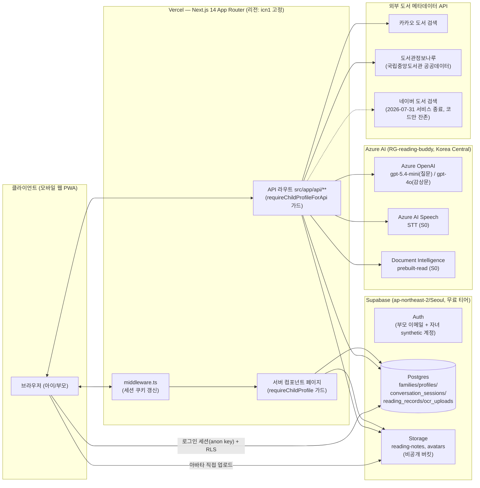
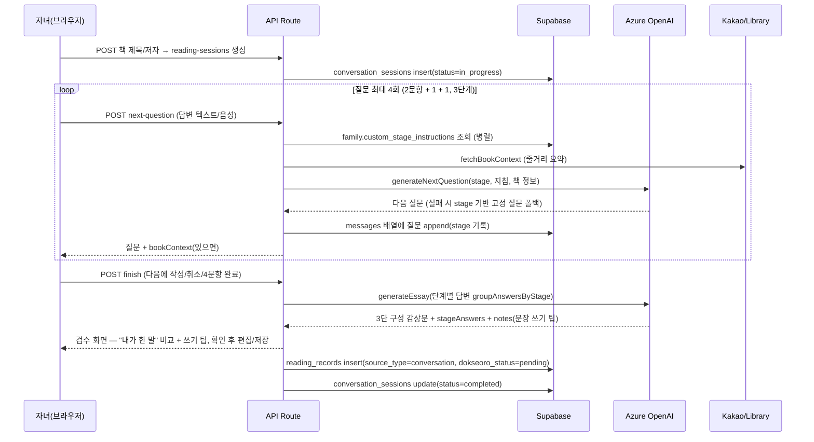
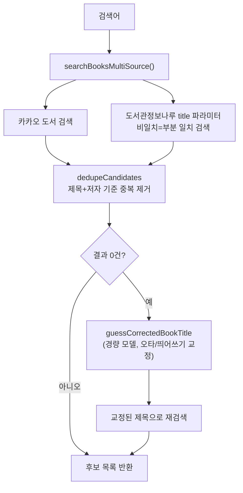

# 아키텍처 문서 — 리딩버디 (Reading Buddy)

**문서 버전:** v1.1
**작성일:** 2026-09-12 (최종 갱신: 2026-09-12)
**성격:** **실제 구현(as-built) 기준** 기술 참조 문서. [PRD.md](PRD.md) 6장은 최초 설계 시점(Azure Static Web Apps/Functions, Playwright 자동화 전제)의 계획이며, 실제로는 상당 부분 다르게 구현됐다 — 이 문서가 현재 코드베이스와 어긋나면 **이 문서를 코드에 맞춰 갱신**할 것(PRD는 의사결정 배경 기록용으로 그대로 둠).

---

## 1. 개요

리딩버디는 **Next.js 14(App Router) 단일 애플리케이션**으로, 프론트엔드·API 라우트·인증 미들웨어가 하나의 저장소·하나의 Vercel 배포에 통합돼 있다. 데이터/인증/파일 저장은 **Supabase**, AI 기능(질문 생성·감상문 생성·STT·OCR)은 **Azure AI 서비스**, 책 메타데이터 조회는 **카카오/도서관정보나루(공공데이터)** 외부 API를 사용한다. 별도의 백엔드 서버, 메시지 큐, 서버리스 함수 플랫폼(Azure Functions 등)은 존재하지 않는다.



---

## 2. 기술 스택

| 영역 | 기술 | 비고 |
|---|---|---|
| 프론트엔드 프레임워크 | Next.js 14.2.35 (App Router) | 서버 컴포넌트 위주, 클라이언트 컴포넌트는 폼/대화형 UI에 한정 |
| UI | React 18 + Tailwind CSS | 차트도 별도 라이브러리 없이 순수 CSS(`div` 비율)로 구현(6.2 참고) |
| 언어 | TypeScript | `tsc --noEmit`로 타입 검사 |
| DB/Auth/Storage | Supabase (`@supabase/supabase-js`, `@supabase/ssr`) | Postgres 15, RLS 활성화 |
| AI SDK | `openai` npm 패키지 | Azure OpenAI를 OpenAI 호환 엔드포인트로 호출(baseURL을 Azure로 지정) |
| 비밀번호 해시 | `bcryptjs` | 자녀 synthetic 계정 비밀번호, PIN 해시 |
| 테스트 | Vitest 2.1.9 | 순수 함수 단위 테스트 50개 (`npm run test`, §9 참고) |
| 배포 | Vercel (Hobby) | `vercel.json`에 `regions: ["icn1"]` 고정 |
| 코드 품질 | ESLint(`eslint-config-next`) | |

---

## 3. 디렉터리 구조 (핵심만)

```
src/
  middleware.ts                 # 모든 요청에서 Supabase 세션 쿠키 갱신
  lib/
    supabase/                   # client/server/admin 클라이언트 팩토리
    currentProfile.ts           # getSession() 기반 현재 프로필 조회, requireChildProfile()
    childAuth.ts                # PIN 검증/잠금, synthetic 계정 로그인, requireChildProfileForApi()
    azureOpenAI.ts              # generateNextQuestion / generateEssay / parseOcrRecord /
                                 # guessCoverTitle / guessCorrectedBookTitle
    azureSpeech.ts               # STT (REST 단문 인식)
    pcmRecorder.ts               # 브라우저 마이크 녹음 → 16kHz mono WAV(PCM) 인코딩
    documentIntelligence.ts     # OCR (analyze → Operation-Location 폴링, analyzeImageBytes)
    readingSession.ts           # 단계별 질문 프레임워크 상수/헬퍼 (STAGE_PLAN 등)
    coachPresets.ts             # AI 질문 코치 프리셋 3종
    kakaoBook.ts / naverBook.ts / libraryBook.ts / bookSearch.ts
                                 # 도서 메타데이터 다중 소스 조회 + 중복 제거
    avatarPhoto.ts               # 아바타 사진 서명 URL 발급
    badges.ts                   # 배지 계산(즉석 집계)
    readingStats.ts             # 월별 통계 집계
    siblingReadingCounts.ts     # 형제자매 이번 달 권수만 좁게 조회(서비스 역할)
    recordsPaging.ts            # 기록 목록 페이지 크기 등 서버 컴포넌트 안전 상수
  app/
    (인증) login/ signup/
    (프로필) profiles/ profiles/new/ profiles/[id]/pin/
    (자녀 홈) home/
    (기록 생성) read/new/ read/new/book/ read/[id]/chat/ read/[id]/review/
               read/ocr/new/ read/ocr/[id]/review/
    (기록 관리) records/ records/[id]/
    (부모 설정) settings/ settings/children/ settings/coach/
               settings/records/ settings/stats/ settings/badges/
    api/
      auth/{signup,login,logout}
      children/, children/[id]/, children/[id]/pin, children/[id]/reset-pin
      reading-sessions/[id]/{next-question,essay,finish}
      ocr-uploads/, ocr-uploads/[id]/finish
      reading-records/[id]
      book-search, book-cover-lookup
      speech/transcribe
      family/coach-settings
supabase/migrations/0001~0009_*.sql
test/stubs/server-only.ts       # vitest에서 server-only 모듈 우회용 스텁
```

---

## 4. 인증/인가 아키텍처

### 4.1 이중 계층: 부모 로그인 + 자녀 synthetic 세션

- **부모**: Supabase Auth 이메일/비밀번호로 정식 로그인하는 유일한 주체.
- **자녀**: 별도 이메일 없음. `profile_id + 4자리 PIN`을 서버로 보내면, family 코드로 특정한 뒤 **PIN에서 결정론적으로 파생한 비밀번호**로 synthetic 이메일 계정에 로그인시켜 **실제 Supabase Auth 세션**을 발급한다(`src/lib/childAuth.ts`). 이 시점부터 부모 세션은 자녀 세션으로 완전히 교체된다.
- 역할(`parent`/`child`) 판별은 **JWT 클레임이 아니라 `profiles.role` 컬럼**으로 한다 — `public.my_role()` SQL 함수(§5.2)를 통해 RLS 정책과 애플리케이션 양쪽에서 동일하게 사용.

### 4.2 세션 검증 경로 (성능 최적화 반영)

- `middleware.ts`가 **모든 요청**에서 `supabase.auth.getUser()`로 세션을 검증/갱신한다(표준 `@supabase/ssr` 패턴, matcher는 정적 자산 제외 전체 경로).
- 페이지/API 라우트는 그 뒤에 다시 `getUser()`를 호출하지 않는다 — `src/lib/currentProfile.ts`가 쿠키의 JWT를 네트워크 왕복 없이 로컬에서 읽는 **`getSession()`**을 사용해 왕복 하나를 없앴다(2026-09-11 성능 개선, §8 참고). 미들웨어가 이미 같은 요청 생명주기 안에서 검증을 마쳤다는 전제에 의존한다.

### 4.3 역할 기반 접근 가드 (페이지 + API 이중 방어)

프론트엔드 라우팅 차단만으로는 부모가 자녀 전용 URL/API를 직접 호출해 우회할 수 있다는 점을 실제로 발견(2026-09-11~12)하고 두 계층 모두에 가드를 뒀다.

| 계층 | 가드 | 적용 대상 |
|---|---|---|
| 페이지(서버 컴포넌트) | `requireChildProfile()` | `/read/new`, `/read/new/book`, `/read/ocr/new`, `/read/[id]/chat`, `/read/[id]/review` 등 — 서버 컴포넌트가 확인 후 클라이언트 폼 컴포넌트(`NewBookForm`/`NewOcrForm` 등)를 렌더링 |
| API 라우트 | `requireChildProfileForApi()` | `book-cover-lookup`, `book-search`, `ocr-uploads`, `ocr-uploads/[id]/finish`, `reading-sessions/*` 등 — 로그인 여부뿐 아니라 role까지 검사 |

두 계층 중 하나만 있으면 우회 가능하다는 것이 실제로 발견된 결함이었으므로, **새 자녀 전용 라우트를 추가할 때는 반드시 페이지+API 양쪽에 가드를 넣을 것**.

### 4.4 Row Level Security (DB 레벨 최종 방어선)

- 자녀도 synthetic 계정으로 실제 `auth.uid()`를 가지므로, RLS 정책이 "같은 가족인가"뿐 아니라 **"본인 프로필인가"까지 DB 레벨에서 강제**할 수 있다(twin_choice 패턴 재사용, PRD 9.1 구현 노트).
- 헬퍼 함수 3종(`public.my_family_id()`, `public.my_profile_id()`, `public.my_role()`)은 `security definer` + `search_path` 고정으로 정의돼, RLS 정책 안에서 `profiles`를 다시 조회할 때 무한 재귀를 피한다(`0002_functions_triggers.sql`).
- 정책 패턴(모든 자녀 데이터 테이블 동일): `family_id = my_family_id() AND (my_role() = 'parent' OR child_profile_id = my_profile_id())` — 부모는 가족 전체, 자녀는 본인 것만.
- **프로비저닝(가족/계정 생성, 자녀 삭제 등)은 전부 서버(`SUPABASE_SERVICE_ROLE_KEY`)에서 RLS를 우회**해 처리한다. 이 키는 브라우저로 내려가지 않는다.
- **역할별 필드 제한은 RLS로 표현할 수 없다** — 예: "행 자체는 부모가 수정 가능하지만 `dokseoro_status` 필드만은 부모 전용"인 경우, RLS는 행 단위 접근만 가르므로 API 라우트 코드가 직접 `profile.role !== 'parent'`를 검사해 403을 반환한다(`/api/reading-records/[id]` PATCH).

---

## 5. 데이터 모델

### 5.1 테이블 (실제 스키마 원본: `supabase/migrations/0001_schema.sql` 이하)

| 테이블 | 주요 컬럼 | 비고 |
|---|---|---|
| `families` | `id`, `name`, `join_code`(unique), `custom_stage_instructions`(jsonb, nullable) | 자녀 로그인 시 "어느 가족인지" 특정하는 데 `join_code` 사용. AI 질문 코치 커스터마이즈 값 보관(`0009`) |
| `profiles` | `id`, `family_id`, `user_id`(→auth.users, unique), `role`(parent/child), `name`, `avatar`(기본 이모지), `avatar_photo_path`(nullable, `0007`), `pin_hash`, `pin_fail_count`, `pin_locked_until`(`0005`) | 부모/자녀 모두 실제 `auth.users` row를 가짐 |
| `conversation_sessions` | `id`, `family_id`, `child_profile_id`, `book_title`, `book_author`, `messages`(jsonb — role/content/created_at/**stage**/**isFollowUp**), `status`(in_progress/completed) | `stage` 필드로 각 질문이 몇 단계인지, `isFollowUp`으로 팔로업 질문인지 기록(둘 다 마이그레이션 없이 jsonb 확장) |
| `reading_records` | `id`, `family_id`, `child_profile_id`, `book_title`, `book_author`, `source_type`(conversation/ocr/manual), `content`, `source_ref_id`(다형 참조, **FK 제약 없음**), `recorded_at`, `dokseoro_status`(pending/synced/failed), `updated_at`(트리거 자동 갱신) | 최종 독서 기록 |
| `ocr_uploads` | `id`, `family_id`, `child_profile_id`, `image_path`(Storage 경로), `raw_text`, `parsed_result`(jsonb), `status`(pending/processed/failed) | |
| ~~`dokseoro_credentials`~~ | — | **2026-09-12 `0008`로 제거됨.** '독서로' 자동 연동을 자격증명 저장 없는 수동 가이드 버전으로 확정하면서 죽은 스키마가 되어 삭제(트리거·RLS 정책도 테이블과 함께 제거) |

### 5.2 스토리지 버킷 (둘 다 비공개, RLS로 가족 단위 스코프)

| 버킷 | 경로 규칙 | 접근 |
|---|---|---|
| `reading-notes` | `{family_id}/{profile_id}/{timestamp}.jpg` | 조회: 같은 가족. 삽입: 본인 프로필 폴더에만 (`0004_storage.sql`) |
| `avatars` | `{family_id}/{profile_id}` (확장자 없음, 항상 upsert) | 조회: 같은 가족. 업로드/교체/삭제: 부모만. 화면 노출은 매번 새로 발급하는 **서명 URL(TTL 7일)** — `src/lib/avatarPhoto.ts` |

### 5.3 마이그레이션 이력

| 파일 | 내용 |
|---|---|
| `0001_schema.sql` | 핵심 테이블 5개 + `dokseoro_credentials`(이후 제거) |
| `0002_functions_triggers.sql` | `my_family_id`/`my_profile_id`/`my_role`, `updated_at` 트리거 |
| `0003_rls.sql` | RLS 정책 전체 |
| `0004_storage.sql` | `reading-notes` 버킷 + 정책 |
| `0005_pin_lockout.sql` | `pin_fail_count`/`pin_locked_until` |
| `0006_grants.sql` | "Automatically expose new tables" 옵션을 끈 프로젝트에서 필요한 명시적 GRANT(`alter default privileges`) — **새 테이블 추가 시 반드시 커버 여부 재확인** |
| `0007_avatar_photo.sql` | `avatar_photo_path` 컬럼 + `avatars` 버킷/정책 |
| `0008_drop_dokseoro_credentials.sql` | 죽은 스키마 제거 |
| `0009_custom_stage_instructions.sql` | `families.custom_stage_instructions` |

> 이 프로젝트의 마이그레이션은 `supabase db push`가 아니라 **Supabase 대시보드 SQL Editor에서 번호 순서대로 수동 실행**하는 방식으로 적용해왔다. 새 마이그레이션을 추가하면 실제 프로젝트에도 직접 실행해야 반영된다.

---

## 6. 핵심 기능별 요청 흐름

### 6.1 대화 기반 독서 기록



- 질문 생성은 저지연 경량 모델(`AZURE_OPENAI_QUESTION_DEPLOYMENT`, 실제 `gpt-5.4-mini`), 감상문 생성은 상위 품질 모델(`AZURE_OPENAI_ESSAY_DEPLOYMENT`, 실제 `gpt-4o`) — 둘 다 `max_completion_tokens` 파라미터 사용(`max_tokens`는 신형 모델에서 400 에러).
- `generateNextQuestion`은 **어떤 실패 경로든 항상 `Promise<string>`을 반환**하도록 정리돼 있다 — API 예외든, 응답은 왔지만 질문이 빈 문자열이든, 전부 `readingSession.ts`의 stage 기반 고정 질문으로 수렴한다(2026-09-12 정리, 이전에는 null 반환 시 범용 문구로 대체되는 별도 경로가 있었음).
- 부모가 `/settings/coach`에서 설정한 `custom_stage_instructions`(또는 `coachPresets.ts`의 프리셋 3종을 불러와 저장한 값)가 있으면 그 문구를, 없으면 `DEFAULT_STAGE_INSTRUCTIONS`를 사용(`resolveStageInstruction`).
- **질문 그라운딩**: 시스템 프롬프트가 "줄거리 요약에 나온 구체적 사건/인물 이름을 최소 하나는 넣어라"를 명시적으로 강제한다(2026-09-12 이전에는 단계 지침이 완성된 질문 문장을 거의 정해줘서 AI가 `bookContext`를 참고할 유인이 없었음). `bookContext`가 줄거리가 아니라 "OO주년 기념 개정판" 같은 출판 마케팅 문구뿐인 경우(카카오 API에서 실제로 관측됨)는 그 문구를 무시하고 모델이 원래 아는 지식으로 대체하도록 허용한다.
- **팔로업 질문**: `readingSession.ts`의 `isAnswerTooShort()`가 짧거나(3자 이하) 흔한 회피성 답변("몰라" 등)을 AI 호출 없이 즉시 판정하면, `next-question` 라우트가 같은 stage에서 한 번 더(단계당 최대 `MAX_FOLLOW_UPS_PER_STAGE=1`회) 캐묻는 질문을 끼워 넣는다. 팔로업 질문은 `ConversationMessage.isFollowUp=true`로 표시되고 "계획된 질문" 진행 카운트에서 제외되지만(응답의 `progress.current`가 늘지 않음), `generateEssay`의 `groupAnswersByStage`가 답변을 모을 때는 정규 답변과 함께 포함된다.
- **음성 입력**: 브라우저 `MediaRecorder`의 기본 포맷(webm/opus)을 Azure STT 단문 인식 REST API가 지원하지 않아서, Web Audio API로 raw PCM을 캡처해 16kHz mono WAV로 직접 인코딩하는 `src/lib/pcmRecorder.ts`를 사용한다.
- **대화 중단**: "다음에 작성"은 세션을 `in_progress`로 그대로 두고 홈으로 이동(나중에 "이어서 쓰기"로 재진입). "취소"는 `DELETE /api/reading-sessions/[id]`(admin 클라이언트)로 세션 자체를 삭제한다 — `conversation_sessions`에는 RLS delete 정책이 없어 런타임에서 직접 지울 수 없기 때문에, 라우트가 소유권(본인+`in_progress`)을 먼저 확인한 뒤 서비스 역할로 삭제한다.
- **감상문 검수**: `generateEssay`가 `essay` 외에 `stageAnswers`(단계별 원본 답변)와 `notes`(문단별 문장 쓰기 팁 3개)를 함께 반환한다. `ReviewSession`은 저장 전에 먼저 "내가 한 말 vs 감상문 문단" 비교 화면을 보여주고 "다 읽었어요, 확인했어요"를 눌러야 편집/저장 화면으로 넘어간다. 쓰기 팁은 아이의 실제 답변과 감상문 문장의 표현 차이만 짚도록 프롬프트에 명시해 PRD 8절의 창작 금지 원칙을 지킨다.

### 6.2 독서노트 OCR 입력

1. 사진 업로드 → `ocr_uploads` insert(status=pending), `reading-notes` 버킷에 저장
2. `analyzeImage`(Document Intelligence, prebuilt-read) → Operation-Location 폴링으로 텍스트 추출
3. `parseOcrRecord`(경량 모델)로 원문을 책 제목/내용으로 구조화 — **창작 없이 재배열만**
4. 실패 시에도 에러를 던지지 않고 `status=failed`로 기록, 빈 칸인 채로 동일한 수정 화면을 열어 직접 입력 경로 제공
5. 저장 시 `reading_records`(source_type=ocr) insert

### 6.3 표지 사진으로 책 찾기

`사진` → `POST /api/book-cover-lookup` → `analyzeImageBytes`(사진을 Storage에 올리지 않고 바이트를 바로 전달 — 일회성 검색 보조라 저장 불필요) → `guessCoverTitle`(제목/저자 추정) → `searchBooksMultiSource`(카카오+도서관정보나루 병렬, 최대 5개 후보) → 화면에서 **사람이 직접 선택**해 제목/저자 필드 확정. OCR+AI 추정을 자동 확정하지 않는 것이 원칙(OCR 입력 기능과 동일하게 "AI는 보조, 최종 확인은 사람").

### 6.4 도서 검색 다중 소스 (자동완성/표지 인식 공용)



- 네이버 도서 검색은 코드(`naverBook.ts`)는 남아 있으나 **2026-07-31 서비스 종료**로 사실상 비활성(키가 없으면 조용히 빈 배열). 알라딘은 2026-09-04 신규 키 발급 중단(2026-10-30 서비스 종료 예정)이라 애초에 연동하지 않음.
- 도서관정보나루는 `title` 파라미터(부분 일치)를 써야 자동완성처럼 동작한다 — `keyword` 파라미터는 매뉴얼상 "일치검색만" 지원해 자동완성에는 부적합(실제로 이 실수를 했다가 공식 매뉴얼 확인 후 수정한 이력이 있음, `libraryBook.ts` 주석 참고).
- AI 오타 교정(`guessCorrectedBookTitle`)은 **검색이 0건일 때만** 호출돼 평소에는 추가 비용이 없다.

### 6.5 '독서로' 수동 등록 가이드

완전 자동화(크롤링/Playwright) 대신, 기록 상세 화면에서 (1) 클립보드 복사 (2) `read365.edunet.net` 새 탭 열기 (3) 완료 체크 토글(`dokseoro_status` pending↔synced)을 제공한다. 토글은 **부모만** 조작 가능(§4.4의 API 레벨 역할 검사).

### 6.6 기록 목록 무한 스크롤 + 검색

- `RecordsBrowser`(클라이언트 컴포넌트)가 자녀 화면(`/records`)과 부모 대시보드(`/settings/records`) 양쪽에서 공용으로 쓰인다 — RLS(`reading_records_select`)가 "본인 것만" vs "가족 전체"를 이미 갈라주므로 컴포넌트 자체는 role을 구분하지 않는다.
- 서버 컴포넌트가 첫 페이지(`RECORDS_PAGE_SIZE=15`, `src/lib/recordsPaging.ts`)만 미리 조회해서 초기 렌더를 빠르게 하고, 이후 페이지는 `IntersectionObserver`로 감지한 스크롤에 따라 브라우저가 Supabase(anon key + RLS)를 직접 호출해 이어붙인다. 검색어(제목/내용, `ilike`, 디바운스)·날짜 범위 필터가 바뀌면 처음부터 재조회한다.
- 총 권수(`· N권`)는 `.range()` 없는 head-count 쿼리로 구해서 전체 행을 받아오지 않는다.
- 요청이 순서와 다르게 도착해도 최신 요청만 반영하는 가드(`requestIdRef`, 책 제목 자동완성의 `latestQueryRef`와 동일한 패턴)로 경쟁 상태를 막는다.
- 부모 대시보드는 자녀별로 `ChildRecordsTabs`가 별도의 `RecordsBrowser` 인스턴스를 `key`로 강제 리마운트하며 렌더링한다 — 자녀 수가 늘어도(4명까지 테스트) 한 화면이 세로로 길어지지 않게 하고, 탭 전환 시 이전 아이의 검색/스크롤 상태가 남지 않게 한다.
- `toIlikePattern()`이 `ilike` 검색어의 `%`/`_` 와일드카드와 `.or()` 필터 문법의 구분자(콤마·큰따옴표)를 이스케이프한다(유닛 테스트로 커버).

### 6.7 통계/배지 계산

- 별도 집계 테이블 없이 **매 요청마다 `reading_records`에서 즉석 계산**한다(`readingStats.ts`, `badges.ts`) — 스키마 변경 없이 구현하기 위한 선택.
- 자녀 세션은 RLS상 형제자매의 `reading_records`를 볼 수 없다(의도된 프라이버시 경계). "이달의 다독왕" 배지 계산에 한해서만 `siblingReadingCounts.ts`가 **서비스 역할로 `child_profile_id`/`recorded_at`(집계용 두 컬럼만)**을 좁게 조회한다 — 책 제목·내용은 절대 조회하지 않음.

---

## 7. 외부 연동 요약

| 연동 | 용도 | 실패/제약 시 동작 |
|---|---|---|
| Azure OpenAI (`gpt-5.4-mini`) | 질문 생성, OCR 구조화, 표지 제목 추정, 오타 교정 | 질문 생성 실패 시 stage 기반 고정 질문 폴백 |
| Azure OpenAI (`gpt-4o`) | 감상문 생성 | 세션당 1회 호출 |
| Azure AI Speech (S0) | 음성 답변 STT | 실패 시 텍스트 입력으로 대체 가능(마이크 버튼과 별개 입력창 존재) |
| Azure AI Document Intelligence (S0, prebuilt-read) | 독서노트/표지 OCR | 실패 시 `status=failed` 기록 후 직접 입력 경로 |
| 카카오 도서 검색 API | 줄거리 요약, 자동완성, 표지 후보 | 조회 실패/결과 없음 → null 처리, 제목/저자만으로 폴백 |
| 도서관정보나루 (공공데이터) | 위와 동일 + 그림책/절판 도서 보강 | 인증키 승인 전에는 빈 배열 |
| 네이버 도서 검색 | (사실상 비활성) | 서비스 종료 — 키 없으면 조용히 스킵 |

---

## 8. 배포 및 성능

### 8.1 배포

- Vercel, `main` 브랜치 push마다 자동 재배포(GitHub 연동 기본 동작).
- 환경변수는 `.env.local`과 동일한 17개 키를 Vercel Environment Variables(Production/Preview)에 등록.
- 프로덕션: **https://reading-buddy-ten.vercel.app**

### 8.2 리전 정합성

Supabase 프로젝트가 서울(ap-northeast-2)인데 Vercel 서버 함수 기본 리전은 버지니아(iad1)라 서버 컴포넌트 하나가 렌더링될 때마다 한국↔미국을 왕복하던 문제를 발견 — `vercel.json`에 `{"regions": ["icn1"]}`을 추가해 서울로 고정했다(Hobby 플랜에서의 실제 반영 여부는 `x-vercel-id` 응답 헤더로 재확인 필요).

### 8.3 조회 병렬화

`/home`, `/settings/stats`, `/settings/badges`, `/settings/records`처럼 서로 의존하지 않는 여러 Supabase 조회를 순차 `await`하던 것을 `Promise.all`로 묶고, 같은 테이블·다른 필터로 중복 조회하던 것(예: 최근 5건 + 전체 기록)은 한 번만 조회해 JS에서 슬라이스하도록 정리했다. 다음 조회가 이전 결과값에 의존하는 경우(`records/[id]` 등)는 원래도 병렬화 불가능해 그대로 둠.

### 8.4 인증 왕복 제거

§4.2 참고 — 미들웨어의 `getUser()`와 별개로 페이지가 또 `getUser()`를 호출하던 중복을 `getSession()`으로 대체.

### 8.5 의도적으로 유지한 패턴

`router.push(...); router.refresh();`(로그인/PIN/로그아웃 직후 여러 곳)은 성능상 불필요해 보일 수 있으나, 형제자매가 같은 URL을 서로 다른 세션으로 방문할 때 **Next.js Router Cache가 이전 아이의 캐시된 화면을 보여줄 위험**을 막는 방어 코드로 판단해 그대로 뒀다. 제거 시 "동생 로그인했는데 형 데이터가 잠깐 보이는" 버그가 재발할 수 있다.

### 8.6 Next.js의 fetch 캐싱은 "동적 렌더링"과 별개 축이다 (실제로 겪은 함정)

`cookies()`를 읽어 동적 렌더링되는 서버 컴포넌트 페이지여도, 그 안에서 실행되는 개별 `fetch()` 호출은 **기본값(`force-cache`)을 그대로 따른다** — Supabase 서버 클라이언트(`@supabase/ssr`)의 PostgREST 호출도 내부적으로 `fetch`를 쓰므로 이 규칙에서 예외가 아니다. `src/lib/supabase/server.ts`가 커스텀 fetch/cache 옵션을 지정하지 않고 있어서, `/records`에서 실제로 기록이 있는데도 "아직 기록한 책이 없어요"가 뜨는(캐시된 빈 결과가 재사용된) 버그가 실제로 발생했다. **Supabase로 사용자별 데이터를 조회하는 모든 페이지에 `export const dynamic = "force-dynamic"`을 명시적으로 선언해야 한다** — 새 페이지를 추가할 때 빠뜨리기 쉬운 지점이라 체크리스트에 넣을 것.

### 8.7 "use client" 모듈의 export를 서버 컴포넌트가 import하면 안 된다 (실제로 겪은 함정)

Next.js는 `"use client"`가 선언된 모듈을 서버 컴포넌트가 import하면, 컴포넌트뿐 아니라 그 모듈이 export하는 **일반 상수/함수까지** 실제 값 대신 클라이언트 레퍼런스 프록시 객체로 치환한다. `RECORDS_PAGE_SIZE` 상수가 `RecordsBrowser.tsx`(`"use client"`)에서 export되고 있었는데, 이를 import해 `.range(0, RECORDS_PAGE_SIZE - 1)`에 쓰던 서버 컴포넌트(`records/page.tsx` 등)에서는 이 값이 `NaN`이 되어 PostgREST가 항상 빈 배열을 반환했다 — §8.6과 증상(빈 목록)이 같아서 원인 파악에 혼선이 있었다. **서버/클라이언트 양쪽에서 쓰는 상수·순수 함수는 `"use client"`가 없는 별도 모듈(`src/lib/recordsPaging.ts` 같은)로 분리할 것.**

---

## 9. 테스트 전략

- **범위**: 외부 의존성(Supabase/Azure API 호출) 없이 **입력→출력만 있는 순수 함수**만 Vitest로 단위 테스트한다. 서버 컴포넌트·API 라우트·RLS 같은 통합 동작은 Supabase/Azure를 모킹하는 큰 작업이 필요해 현재 범위 밖.
- **대상 모듈**: `readingSession.ts`(단계별 질문 매핑/폴백), `badges.ts`(배지 계산, 형제자매 비교 경계값), `readingStats.ts`(월별 집계), `childAuth.ts`(PIN 검증/잠금 판정, PIN→비밀번호 파생의 결정론성, bcrypt 해시), `bookSearch.ts`(중복 제거), `libraryBook.ts`(저자 필드 정리), `coachPresets.ts`.
- **총 50개 테스트(8개 파일)**, `npm run test` (watch는 `npm run test:watch`) — `coachPresets.ts`(프리셋 뼈대 유지 검증), `bookSearch.ts`(다중 소스 중복 제거), `libraryBook.ts`(저자 필드 정리), `RecordsBrowser.tsx`의 `toIlikePattern`(ilike 검색어 이스케이프)이 최초 31개 이후 추가됨.
- **알아둘 점**:
  - `server-only`로 막힌 모듈을 일반 Node 런타임(vitest)에서 그대로 import하면 무조건 예외가 난다(react-server 조건이 있을 때만 빈 모듈로 치환되는 구조) — `vitest.config.mts`에서 `server-only`를 `test/stubs/server-only.ts`(빈 모듈)로 alias해서 우회.
  - vitest 5.x는 peer로 `@types/node@^22`를 요구해 프로젝트의 `@types/node@^20`과 충돌 — 프로젝트 전체 업그레이드 대신 `vitest@^2.1.9`로 고정.
  - 새로 추가하는 순수 로직에는 유닛 테스트를 같이 추가할 것 — `vitest.config.mts`가 `src/**/*.test.ts`를 자동 수집한다.

---

## 10. 알려진 제약 / 기술 부채

| 항목 | 내용 |
|---|---|
| `reading_records.source_ref_id` | `conversation_sessions`/`ocr_uploads`를 가리키는 다형 참조인데 **FK 제약이 없다**(타입에 따라 대상 테이블이 달라 걸 수 없음) — 애플리케이션 코드가 정합성을 책임짐 |
| 배지/통계 즉석 계산 | 기록이 매우 많아지면 매 요청 집계 비용이 늘어날 수 있음 — 현재 가정 단위 사용량(자녀 2명, 월 수십 건)에서는 문제없음. 필요해지면 캐시 테이블/materialized view 검토 |
| 장르 분포 통계 미구현 | 스키마에 장르 컬럼이 없음 — 카카오 API 응답을 저장하는 컬럼과 마이그레이션이 선행돼야 함 |
| '독서로' 완전 자동화 미구현 | 이용약관상 자동화 허용 여부 미확인 — PRD 9.7 |
| Supabase 무료 프로젝트 7일 비활성 자동 일시정지 | 정기 핑(cron) 미구현 — 방학 등 공백기 리스크 |
| PWA 설치 아이콘 미설정 | `manifest.json`의 `icons: []` — 실제 홈 화면 설치 아이콘 없음 |
| 도서 메타데이터 API 잔존 코드 | 네이버 연동 코드는 서비스 종료 후에도 남아 있음(키 보유자를 위한 하위 호환, 해는 없음) |
| 마이그레이션 적용 방식 | `supabase db push`가 아니라 SQL Editor 수동 실행 — 새 마이그레이션 추가 시 사람이 직접 실행해야 실제 DB에 반영됨(자동화 없음) |

---

## 11. 참고 문서

- [PRD.md](PRD.md) — 요구사항 전체 및 의사결정 배경 (계획 당시 아키텍처는 6장, 실제와 다른 부분은 각 절의 "구현 노트" 참고)
- [BRIEF.md](BRIEF.md) — 프로젝트 한눈에 보기
- [STORIES.md](STORIES.md) — 기능 단위 사용자 스토리
- [../CLAUDE.md](../CLAUDE.md) — 구현·검증 진행 현황(살아있는 소스), Supabase/Azure 셋업 중 발견한 함정 모음
- [../README.md](../README.md) — 로컬 개발 셋업, 환경변수, 테스트 실행법
