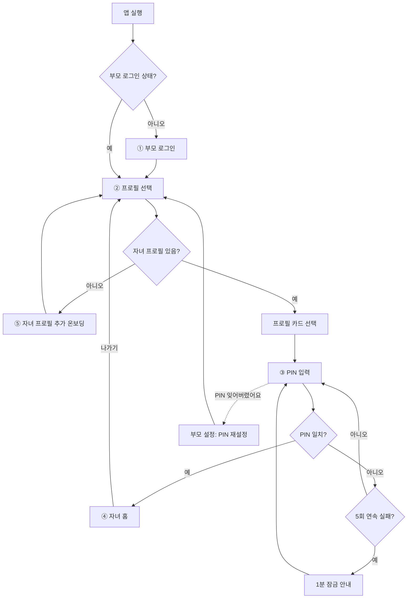
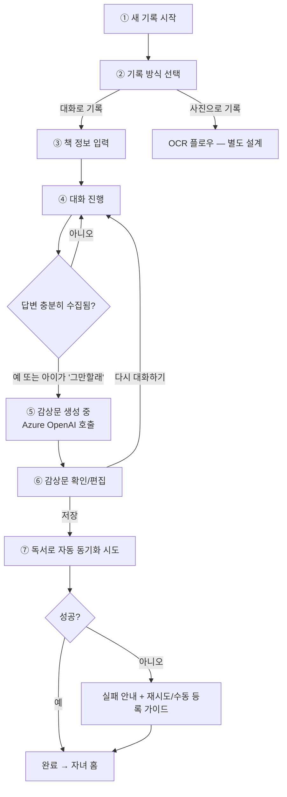
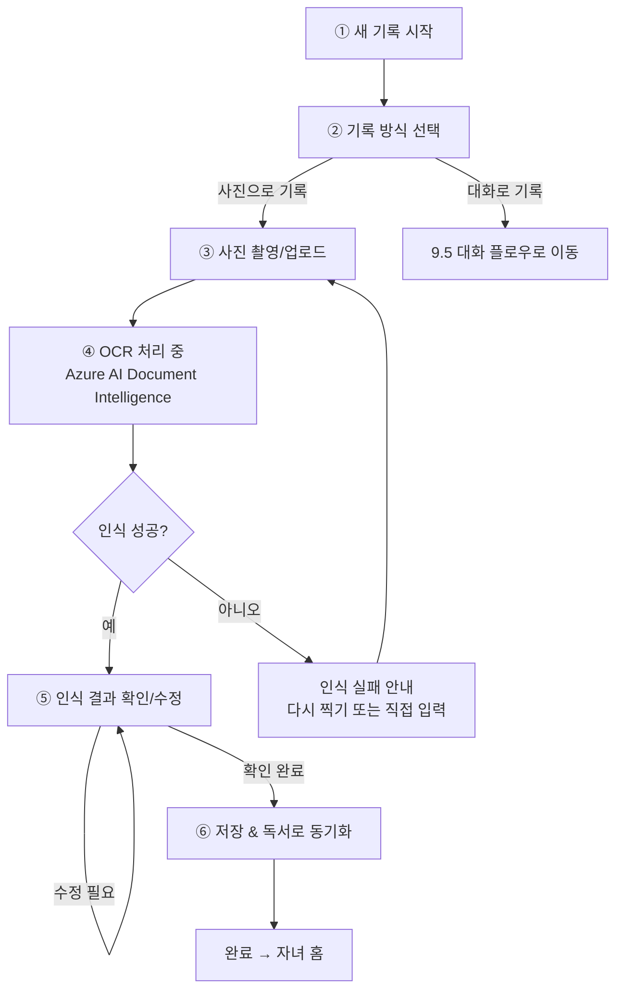

# 독서 기록 앱 PRD (Product Requirements Document)

**문서 버전:** v2.1  
**작성일:** 2026-09-10 (최종 갱신: 2026-09-13)  
**프로젝트명:** 리딩버디 (Reading Buddy) — 공식 명칭 확정 (타 서비스와 명칭 중복 방지)

> 함께 보면 좋은 문서: [BRIEF.md](BRIEF.md)(5분 요약) · [STORIES.md](STORIES.md)(기능 단위 사용자 스토리) · [ARCHITECTURE.md](ARCHITECTURE.md)(실제 구현 기준 기술 아키텍처)

---

## 1. 배경 및 문제 정의

초등 3학년 쌍둥이 자녀는 학교/지자체에서 운영하는 독서 기록 사이트 **'독서로'**에 독서 활동을 기록해야 한다. 그러나 다음과 같은 문제가 있다.

- **접근성 문제**: '독서로' 사이트는 PC 중심 UI로, PC 사용이 서툰 아이들이 혼자 이용하기 어렵고 부모의 도움이 매번 필요함.
- **기록 방식의 비효율**: 아이가 읽은 책 중 학교 독서노트(종이)에 작성한 것도 있고, 아예 기록되지 않은 채 지나가는 책도 많음 — 실제 독서량 대비 기록량이 현저히 적음.
- **기록 행위 자체의 진입장벽**: 아이 입장에서 '독서 감상문을 텍스트로 쓰는 것'은 부담스러운 작업이라 기록이 누락되기 쉬움.

**핵심 기회**: 아이가 부담 없이 참여할 수 있는 방식(대화, 사진 촬영)으로 독서 기록의 진입장벽을 낮추고, 그렇게 모인 기록을 '독서로'에 자동으로 반영해 부모와 아이 모두의 수고를 줄인다.

> **구현 노트(2026-09-13, 개발 동기 재확인)**: 사용자가 이 앱을 만든 배경을 다시 설명함 — "독서로와 생기부 연계가 되면서 독서로 기록이 중요해지면서 이 앱을 개발하게 되었어." 교육부가 '독서로' 기록을 나이스(NEIS)와 연동해 학교생활기록부(생기부)에 자동 기재하는 방안을 추진 중이며, 독서활동상황란에는 **"ISBN에 등재된 도서에 한해"** 책 제목/저자를 학기 단위로 입력할 수 있다(대입에 직접 반영되지는 않지만, 세부능력 및 특기사항·창의적 체험활동에 녹여내는 용도로는 중요). 이 배경에 비춰 코드를 재검토해 **ISBN 캡처 기능**을 추가했다(`src/lib/isbn.ts`, `0011_book_isbn.sql`) — 카카오/도서관정보나루/네이버 도서 검색 API가 이미 응답에 포함하고 있던 ISBN을 지금까지 버리고 있었던 것을 발견해 새 API 연동 없이 파싱만 추가함. 상세는 `CLAUDE.md`의 "ISBN 캡처 추가 — 생기부 연계 검토 결과" 참고. '독서로' 완전 자동화 재검토는 이 시점에도 사용자가 선택하지 않아 계속 보류(9.7 참고).

---

## 2. 목표

### 2.1 프로덕트 목표

- 아이가 **모바일에서 스스로** 독서 기록을 남길 수 있게 한다.
- 부모의 개입을 '기록 보조'에서 '검토/승인' 수준으로 낮춘다.
- 실제 독서량과 기록량의 격차를 줄인다.
- **운영 비용은 합리적인 수준으로 관리** — Supabase 등 부가 서비스는 무료 티어 위주로 설계하고, AI 관련 기능은 보유한 **Azure 구독(월 $150 예산)** 내에서 품질과 신뢰성을 우선한 티어를 사용한다.

### 2.2 성공 지표 (안 — 추후 구체화 필요)

- 주간 독서 기록 등록 건수 (아이 1인당)
- '독서로' 자동 반영 성공률
- 부모의 수동 개입(직접 타이핑) 빈도 감소율
- 아이의 앱 자발적 사용 빈도 (부모 독려 없이 실행한 세션 수)
- 월간 Azure 리소스 사용 비용 (예산 내 운영 여부)

---

## 3. 타겟 사용자 및 계정 구조

| 구분 | 설명 |
|---|---|
| **주 사용자 (기록 주체)** | 초등 3학년 쌍둥이 — **별도 계정 없이 부모 계정 아래 프로필로 존재**, PIN으로 본인 프로필 전환, PC 사용 미숙, 모바일/음성 인터페이스에는 익숙 |
| **관리자** | 부모 — **유일하게 정식 로그인하는 주체**, 두 자녀 프로필을 생성·관리, 자녀별 기록 검토/승인, '독서로' 계정 연동 설정 |

### 3.1 계정 구조 (확정)

- **로그인은 부모 계정 1개로만 수행** — 자녀는 별도 계정/로그인 없음
- 부모 로그인 후 앱 진입 시 **프로필 선택 화면**(넷플릭스 프로필 방식과 유사)에서 자녀 프로필(쌍둥이 각 1개)을 선택
- 자녀 프로필 선택 시 **PIN 번호**를 입력해 해당 프로필로 전환 — 전환 후에는 본인 기록만 노출
- 즉, 인증 주체는 부모 1명이며, 자녀 PIN은 "로그인"이 아니라 **부모 계정 내 프로필 전환 잠금**의 개념
- **PIN 정책(확정, 심플하게)**: 숫자 4자리, 5회 연속 실패 시 1분간 잠금 후 재시도 가능. 분실 시 부모 로그인 화면에서 재설정
- 향후 다른 가정으로 확장 시에도 "부모 계정 1개 : 자녀 프로필 N개" 구조가 기본 단위가 되도록 설계

---

## 4. 핵심 컨셉

서비스는 하나의 앱이 아니라 **"독서"라는 하나의 챕터(모듈)**로 시작하며, 이후 아이를 위한 다른 기능(예: 학습 기록, 습관 트래커 등)을 챕터 단위로 확장하는 구조를 지향한다. 본 PRD는 **1챕터: 독서 기록**에 한정한다.

### 4.1 멀티 앱 확장 전략 (결정)

이미 쌍둥이 자녀를 대상으로 한 다른 앱(예: 선택 기록 앱 등)이 별도로 존재/개발 중인 상황을 고려해, 앱 포트폴리오 확장 방식을 다음과 같이 확정한다.

- **채택 방향: 공통 플랫폼 + 모듈형 확장** (완전 통합도, 완전 분리도 아닌 중간 방식)
- **공유하는 것**: 부모 계정(Supabase Auth) + 자녀 프로필/PIN 체계 — 아이는 하나의 로그인 경험으로 여러 기능(챕터)에 접근하고, 부모도 계정 관리 지점을 하나로 유지
- **공유하지 않는 것**: 각 챕터(독서 기록, 선택 기록 등)의 핵심 기능과 데이터 모델은 독립적으로 개발·배포 — 한 앱의 문제가 다른 앱에 영향을 주지 않도록 결합도를 낮게 유지
- **현재 적용 범위**: 이미 개발이 진행 중인 다른 앱(예: 선택 기록 앱)을 지금 당장 통합하지는 않되, **자녀 프로필/PIN 테이블 구조를 표준화**해 향후 같은 Supabase 프로젝트/스키마를 재사용할 수 있는 여지를 남겨둔다. 새로 시작하는 앱(본 독서 기록 앱 포함)은 처음부터 이 공통 인증 계층을 기준으로 설계
- **장기적으로는** 여러 챕터를 하나의 셸 앱(탭 구조 등) 안에 묶는 것도 가능하나, 이는 각 챕터가 충분히 안정화된 이후에 재검토

> 이 저장소(리딩버디)는 실제로 자매 앱인 `twin_choice`(선택 기록 앱)의 `families`/`profiles` 스키마와 자녀 PIN 인증 패턴을 그대로 재사용하도록 초기 스캐폴딩됐다 — 4.1의 결정을 코드 수준에서 이미 반영한 것.

### 4.2 MVP 이후 로드맵 (참고용, 우선순위 미확정)

- 읽은 책 자동 인식 (표지 촬영 → 책 정보 자동 매칭, 6.2의 책 정보 조회 API와 연계)
- 독서 통계/리포트 (월간 독서량, 장르 분포 등을 부모에게 리포트)
- 형제/자매 간 독서 기록 비교·선의의 경쟁 요소 (배지, 스탬프 등)
- 4.1에서 결정한 멀티 앱 확장 전략에 따른 다른 챕터(숙제 기록, 습관 트래커 등) 실제 추가
- 네이티브 앱 전환

> **구현 노트(2026-09-10~12 Phase 2)**: 위 후보 중 사용자가 **A. 배포(플랫폼 확장), B. 독서 통계/리포트, C. 읽은 책 자동 인식(표지 촬영), D. 형제자매 비교/배지**를 명시적으로 선택해 모두 구현·검증 완료했다(멀티 앱 확장·네이티브 앱 전환은 선택하지 않아 계속 로드맵으로 남음). 상세 구현·검증 내역은 `CLAUDE.md`의 "Phase 2 범위" 참고. 배포는 Azure Static Web Apps가 아닌 **Vercel**로 확정(6.2 구현 노트 참고), 프로덕션 URL은 https://reading-buddy-ten.vercel.app.

---

## 5. MVP 범위

### 5.1 우선순위 결정 사항 (확인 완료)

- **기록 방식**: 아이와의 **대화(음성/채팅) 기반 기록**을 MVP 핵심 기능으로 우선 개발
- **독서로 연동**: 로그인 후 **자동 크롤링을 통한 자동 등록**
- **플랫폼**: **모바일 웹(PWA)**부터 시작
- **계정 구조**: 부모 계정만 로그인, 자녀는 부모 계정 아래 프로필로 존재하며 PIN 번호로 전환
- **비용 정책**: Supabase(DB/인증/스토리지)는 무료 티어, Azure AI 서비스는 월 $150 예산 내에서 품질/신뢰성 우선의 유료(Standard) 티어 사용 (6.5 참조)

### 5.2 MVP 기능 목록

#### (1) 계정/인증 (기반 기능 — 최우선 구현)

- 부모 계정 가입/로그인 (유일한 정식 로그인 주체)
- 부모가 자녀 프로필 2개 생성, 프로필별 PIN 번호 설정
- 앱 진입 시 프로필 선택 화면 → 자녀 프로필 선택 후 PIN 입력 → 해당 자녀의 기록 화면으로 전환
- 부모 대시보드: 두 자녀의 기록 현황을 한눈에 조회, 프로필/PIN 설정 관리

#### (2) 대화 기반 독서 기록 (핵심 기능)

- 아이가 책을 다 읽으면 앱이 대화형으로 질문을 던져 기록을 유도 (예: "무슨 책 읽었어?", "누가 제일 기억에 남아?", "왜 그렇게 생각했어?")
- 음성 입력 지원 (아이가 타이핑 대신 말로 답할 수 있도록)
- **책 제목으로 무료 도서 API(알라딘 Open API, 카카오 도서 검색 API 등)를 조회해 줄거리/등장인물 등 정보를 가져오고, 이를 컨텍스트로 활용해 더 구체적인 질문 생성** (예: 줄거리를 알면 "그 사건 이후에 주인공은 어떻게 됐어?" 같은 세부 질문 가능) — AI가 직접 웹검색하지 않고 무료 API로 정보를 가져와 요약만 프롬프트에 넣는 방식으로 AI 비용 영향 최소화 (6.4 참조)
- 대화 내용을 바탕으로 AI가 독서 기록문(감상문 형태)을 자동 생성
- 생성된 기록문은 아이/부모가 확인 후 저장

> **구현 노트(2026-09-11 사용자 설계 기반 고도화)**: 위 예시 질문들 같은 범용 "이전 답변 이어서 질문" 방식 대신, 사용자가 직접 설계한 **"단계별 독서록 유도 질문 프레임워크"**를 도입했다 — 단순 질의응답이 아니라 독서록 작성 능력 자체를 길러주는 것이 목표. 1단계 "장면 소환"(사건→행동, 실제로 읽었는지 확인 겸 줄거리 요약) → 2단계 "역할 바꾸기"(공감·"나라면") → 3단계 "현실 적용"(자기 생활과 연결)으로 4개 질문을 고정 매핑하고, 감상문은 이 답변들을 처음(줄거리)-가운데(생각)-끝(현실 연결) 3단 구성으로 조립하는 "독서록 조립 공식"을 따른다. 자세한 구현은 `CLAUDE.md`의 Phase 1 "2. 대화 기반 독서 기록" 항목 참고.

> **구현 노트(2026-09-12 사용자 피드백 반영)**: "매번 같은 질문 패턴이 지루하다"는 피드백에 따라, 위 단계별 지침 문구를 **부모가 직접 수정**할 수 있게 했다(`/settings/coach`, `families.custom_stage_instructions`, 이후 완성된 프리셋 3종을 버튼으로 불러오는 기능도 추가). 전체 시스템 프롬프트 자유 입력이나 프리셋 선택 대신 "단계별 지침 문구만 수정"하는 방식을 사용자가 직접 선택함(AI 오동작 위험을 낮추고 구현 범위를 명확히 하기 위함). 또한 책 검색이 카카오 단독이라 그림책/동화책이 잘 안 걸린다는 피드백을 반영해, 책 제목 자동완성·표지 인식(5.2(2)/(3) 공통)이 **카카오 + 도서관정보나루(국립중앙도서관 공공 오픈데이터) 병행 조회 + 검색 결과 0건일 때 AI 오타 교정 재검색**으로 확장됐다 — 네이버·알라딘 도서 검색 API를 병행 후보로도 검토했으나 둘 다 2026년 중 서비스가 종료되어(7절 리스크 참고) 최종적으로는 도서관정보나루로 대체했다. 상세는 `CLAUDE.md`의 "사용자 피드백 4건 반영"·"책 제목 검색" 절 참고.
>
> **구현 노트(2026-09-12 추가 개선)**: 음성 입력이 실제로는 매번 실패하고 있었음을 발견 — 기존 `MediaRecorder` 기본 포맷(webm/opus)을 Azure STT 단문 인식 REST API가 지원하지 않아, Web Audio API로 raw PCM을 캡처해 16kHz mono WAV로 인코딩하는 방식으로 교체해 해결했다. 또한 "AI 질문이 책 내용과 상관없이 나오는 것 같다"는 피드백을 받고 원인(단계별 지침이 질문 문장 자체를 거의 정해줘서 AI가 줄거리 요약을 참고할 유인이 없었음, 일부 판본은 카카오 요약 자체가 줄거리가 아니라 출판 마케팅 문구뿐이었음)을 찾아 프롬프트에 "요약에 나온 구체적 사건/인물을 최소 하나는 넣어라"는 규칙과 마케팅 문구 무시 폴백을 추가했고, "AI 개입이 더 적극적이면 좋겠다"는 피드백에 따라 아이 답변이 너무 짧거나 성의 없으면(예: "몰라") 같은 단계에서 한 번 더 다정하게 캐묻는 팔로업 질문(단계당 최대 1회)을 추가했다. 감상문 검수 화면에도 "다 읽었어요, 확인했어요" 확인 단계와 원본 답변 대조, 문장 쓰기 팁을 추가해 8절의 "원본 대화 로그를 항상 함께 보관해 대조 확인 가능하게 함" 원칙을 검수 시점부터 더 적극적으로 지키게 했다. 상세는 `CLAUDE.md`의 "음성 인식 수정 + 감상문 검수 화면 개선"·"대화 질문 그라운딩 강화 + 팔로업 질문 추가" 절 참고.

> **구현 노트(2026-09-12, "책 제목이 정확해야하고, 페이지 수가 기록되어야해")**: 카카오·도서관정보나루 도서 검색 API 둘 다 페이지 수를 제공하지 않아, 대화 시작 화면·OCR 검수 화면(5.2(3))에서 페이지 수를 **필수 입력**(양의 정수)으로 추가했다(`conversation_sessions.book_page_count`/`reading_records.page_count`, `0010_page_count.sql`). AI가 페이지 수를 추측하지 않는 것은 8절의 "사실을 창작하지 않는다" 원칙을 숫자 필드까지 확장 적용한 것. 책 제목 정확성은 기존 자동완성(카카오+도서관정보나루, 5.2(2) 구현 노트)이 이미 담당하고 있어 그 원칙은 유지하되, 직접 입력 시 최소 길이 검증을 추가했다.

#### (3) 학교 독서노트 OCR 입력

- 종이 독서노트를 사진으로 촬영
- OCR로 텍스트 추출 → 구조화된 독서 기록(책 제목, 날짜, 내용)으로 변환
- 추출 결과 확인/수정 UI 제공 (OCR 오인식 대비)

#### (4) '독서로' 자동 연동

- 부모 계정에 '독서로' 로그인 정보 등록 (암호화 저장 — 기술 고려사항 참조)
- 앱 내 기록을 '독서로' 형식에 맞게 변환 후 자동 등록(크롤링/자동화)
- 등록 성공/실패 여부 알림, 실패 시 수동 등록 가이드 제공

> **구현 노트(2026-09-10 Phase 1 4번 구현 시 결정)**: 9.7절 리스크 재평가에서 우려한 대로 '독서로' 이용약관상 자동화(크롤링) 허용 여부를 확인하지 못한 상태라, **완전 자동 등록(Playwright)은 만들지 않고 "수동 등록 가이드"만 먼저 구현하기로 사용자가 명시적으로 선택**했다(자동 등록 실패 시 폴백으로 두려던 수동 가이드를, 아예 기본 경로로 격상). 실제로는 기록 상세 화면에 책 제목/날짜/내용을 한 번에 복사하는 버튼, '독서로' 사이트 바로가기 링크, 등록 완료 여부를 사람이 직접 표시하는 토글을 제공한다. 자세한 구현은 `CLAUDE.md`의 Phase 1 "4. '독서로' 자동 연동" 참고. 완전 자동화는 이용약관 확인 후 필요하면 재검토한다.
>
> **구현 노트(2026-09-13, 생기부 연계 배경 재확인)**: 독서활동상황란은 "ISBN에 등재된 도서에 한해" 기재 가능하다는 교육부 지침을 확인하고, 복사 텍스트/기록 상세에 ISBN을 포함하도록 확장했다(1절 구현 노트, `CLAUDE.md` 참고) — 완전 자동화 자체를 다시 만들지는 않았고(자격증명·정부 플랫폼 자동화 리스크는 그대로), 수동 등록을 더 정확하게 하는 정보(ISBN)를 보태는 선에서 대응함.

#### (5) 기록 관리 (기본)

- 자녀별 독서 기록 리스트/히스토리 조회 (본인 계정에서는 본인 것만, 부모 계정에서는 둘 다)
- 책 제목, 날짜, 기록 내용, '독서로' 반영 상태 표시
- 부모의 기록 검토 및 수정 권한

> **구현 노트(2026-09-12)**: 기록이 쌓이면서 `/records`(자녀)·`/settings/records`(부모)에 **무한 스크롤 페이지네이션 + 검색(제목/내용/날짜)**을 추가했다. 부모 화면은 기존의 자녀별 스크롤 나열 대신 **자녀별 탭**으로 전환해 자녀 수가 늘어나도(현재 2명, 확장 여지 고려) 한 화면이 길어지지 않게 했다(4.1의 확장성 원칙과 일치). 개발 중 Next.js의 fetch 캐시로 인해 기록 목록이 빈 화면으로 보이는 버그를 두 차례 발견·수정함(상세는 `CLAUDE.md` 커밋 이력 참고).

---

## 6. 기술 아키텍처 — Azure + Supabase 하이브리드 설계

AI 관련 기능은 보유한 **Azure 구독**을 활용하고, **데이터베이스/인증/스토리지는 Supabase**를 사용하는 하이브리드 구조로 설계한다. Supabase는 Postgres 기반으로 DB·인증·스토리지·실시간 기능을 함께 제공해 소규모 프로젝트에 적합하다.

### 6.1 DB 선택 비교: Supabase vs Azure Cosmos DB

| 비교 항목 | **Supabase (Postgres)** | Azure Cosmos DB |
|---|---|---|
| 데이터 모델 | 관계형(Relational) — 부모/자녀 프로필/기록/책 정보처럼 **관계가 명확한 가족 데이터 구조**에 적합 | NoSQL(문서형) — 관계형 데이터는 비정규화하거나 애플리케이션에서 조인 처리 필요 |
| 무료 티어 | 프로젝트당 500MB DB, 1GB 파일 스토리지, 인증 5만 MAU 등 — 소규모 가정 단위 사용엔 충분 | 25GB 저장 + 1000 RU/s 무료(계정당 1개), 용량은 넉넉하나 RU(처리량) 기반 과금 모델 학습 필요 |
| 부가 기능 | **Auth, Storage, Realtime**이 기본 내장 — 별도 서비스 연동 없이 하나로 해결 가능 | Azure 생태계 내 여러 서비스(AD B2C, Blob Storage 등)를 조합해야 동일 기능 구현 |
| 접근 제어 구현 | **Row Level Security(RLS)**로 "이 기록은 이 자녀 프로필만 조회 가능" 같은 규칙을 DB 레벨에서 선언적으로 구현 가능 | 관계형 접근 제어는 애플리케이션 로직에서 직접 구현해야 함 |
| Azure AI 서비스 연동 | REST API로 문제없이 연동 가능 (Azure OpenAI가 Supabase 데이터를 읽고 쓰는 데 제약 없음) | 같은 Azure 생태계라 리전 내 연동이 다소 유리하나, 본 프로젝트 규모에서는 체감 차이 적음 |
| 학습 곡선 | 표준 SQL 기반이라 상대적으로 낮음 | RU/파티션 키 설계 등 Cosmos 특유의 개념 학습 필요 |

**결론**: "부모 1명 – 자녀 프로필 N개 – 자녀별 기록 N건"처럼 **관계형 구조가 명확**하고, RLS로 "자녀 프로필은 본인 기록만 조회"라는 접근 제어를 DB 레벨에서 손쉽게 구현할 수 있다는 점에서 **Supabase가 더 적합**하다. Auth/Storage도 함께 제공되어 별도 Azure AD B2C 연동 없이 구조를 단순화할 수 있다.

### 6.2 최종 아키텍처

| 영역 | 사용 기술 | 비고 |
|---|---|---|
| **데이터베이스** | **Supabase (Postgres)** | 부모 계정, 자녀 프로필, 독서 기록, 책 정보 등 관계형 데이터 저장 |
| **인증 (부모)** | **Supabase Auth** | 부모만 이메일/비밀번호(또는 소셜 로그인)로 정식 로그인 |
| **자녀 프로필 전환** | **자체 PIN 검증 로직** | 부모 로그인 세션 내에서 자녀 프로필 선택 → PIN 입력으로 전환 (별도 계정/로그인 아님), PIN은 Supabase에 해시로 저장 |
| **파일(이미지) 저장** | **Supabase Storage** | 독서노트 사진, 책 표지 등 — DB와 동일 플랫폼으로 관리 단순화 |
| **책 정보 조회** | **알라딘 Open API** 또는 **카카오 도서 검색 API** (무료) | 책 제목으로 줄거리/저자/장르 등을 조회해 대화 질문 생성 컨텍스트로 활용. AI 모델 내장 웹검색 도구는 호출당 토큰 비용이 크므로 사용하지 않음 (6.4 참조) |
| **대화형 기록 (질문 생성 + 감상문 생성)** | **Azure OpenAI Service** — 질문 생성은 저지연 경량 모델, 최종 감상문 생성은 상위 품질 모델 (하이브리드, 6.5 참조) | 대화 기반 질문·응답 및 감상문 자동 생성의 핵심 엔진 |
| **음성 입력 (아이 발화 → 텍스트)** | **Azure AI Speech (Standard S0)** | 무료 등급(F0)의 월간 사용량 상한을 없애고, 아동 발화 인식률 개선을 위한 Custom Speech 옵션도 예산 내에서 활용 가능 |
| **OCR (독서노트 손글씨 인식)** | **Azure AI Document Intelligence (Standard S0, Read 모델)** | 무료 등급(F0)의 "요청당 2페이지까지만 처리" 제한과 낮은 처리량(1 TPS)을 해제해 신뢰성 확보. Read 모델 자체 단가는 매우 저렴($1.50/1,000페이지)하여 Standard 전환에 따른 비용 부담 적음 |
| **백엔드/API** | **Supabase Edge Functions** + **Azure Functions** | 단순 DB 로직은 Supabase Edge Functions, Azure AI 호출이 필요한 로직은 Azure Functions로 분리 검토 |
| **호스팅 (PWA 프론트엔드)** | **Azure Static Web Apps (무료 티어)** 또는 **Vercel** | PWA 배포 |
| **'독서로' 자동화** | **Azure Functions + 서버리스 브라우저 자동화**(예: Playwright) | 주기적 실행 또는 트리거 기반 실행 |

> **구현 노트(2026-09-10~11)**: 실제로는 백엔드/API를 Supabase Edge Functions나 Azure Functions로 분리하지 않고 **Next.js API 라우트(`src/app/api/**`) 하나로 통일**했다 — Vercel에 프론트엔드와 함께 배포되므로 별도 서버리스 함수 플랫폼을 추가로 운영할 이유가 없었다. 호스팅도 Azure Static Web Apps가 아니라 **Vercel**로 확정(사용자 선택, Phase 2 A). '독서로' 자동화는 Azure Functions+Playwright 대신 **수동 등록 가이드**로 대체했다(5.2(4)/9.7 구현 노트 참고) — 따라서 Azure Functions는 이 프로젝트에서 실제로 쓰이지 않는다.

> **구현 노트(2026-09-12 책 정보 조회 다중화)**: 카카오 도서 검색만으로는 그림책/동화책이 잘 안 걸린다는 피드백에 따라 병행 소스를 검토했으나, **네이버 도서 검색 오픈API(2026-07-31 종료)와 알라딘 Open API(2026-09-04 신규 발급 중단, 2026-10-30 서비스 종료)가 조사 시점에 이미 종료/종료 예정**이라 둘 다 실사용 불가로 확인됨(7절 리스크 참고). 대신 **도서관정보나루(국립중앙도서관 공공 오픈데이터, data4library.kr)**를 세 번째 소스로 추가해 카카오와 병렬 조회(`src/lib/bookSearch.ts`의 `searchBooksMultiSource`)하고, 검색 결과가 0건일 때만 AI로 오타/띄어쓰기를 교정해 재검색하는 폴백을 추가했다. 네이버 연동 코드 자체는 남겨뒀다(키를 이미 보유한 경우를 위한 하위 호환, 없으면 조용히 스킵).

### 6.3 비용 관리 원칙

- **월 Azure 사용 가능 예산: $150** (보유 구독 기준) — 이 예산 내에서는 무료 티어의 제약(처리량 상한, 기능 제한)에 얽매이지 않고 **품질/신뢰성을 우선한 유료(Standard) 티어를 적극 활용**
- Supabase(DB/Auth/Storage)는 가정 단위 사용량 대비 무료 티어로 충분하므로 그대로 무료 티어 유지
- 실제 사용량 기준으로는 유료 티어로 전환해도 예산 대비 지출이 매우 낮을 것으로 예상되며(6.5 참조), 남는 예산은 품질 개선(상위 모델, Custom Speech 등)에 사용

### 6.4 책 정보 조회가 AI 비용에 미치는 영향 (검토 결과)

- **AI 모델의 내장 웹검색 도구는 사용하지 않는다.** OpenAI 계열 모델의 웹검색 도구는 호출당 약 8,000 입력 토큰이 고정 과금되어, 세션마다 반복 호출 시 비용 부담이 커짐
- 대신 **무료 도서 API(알라딘 Open API, 카카오 도서 검색 API 등)** 로 책 제목 기준 줄거리/등장인물/장르 등 메타데이터를 조회 — API 호출 자체는 무료, AI 토큰 비용이 발생하지 않음
- 조회된 정보는 요약(약 300~600 토큰)만 추려 대화 프롬프트의 컨텍스트로 포함

### 6.5 $150/월 예산을 반영한 티어 선택 및 하이브리드 모델 전략

**기본 방향**: 가정 단위 사용량(자녀 2명, 하루 1~2건)에서는 어떤 티어를 선택해도 실제 지출이 예산에 비해 매우 낮으므로, **비용보다 품질과 안정성을 기준으로 티어를 선택**한다.

| 서비스 | 선택한 티어 | 선택 이유 |
|---|---|---|
| **Azure OpenAI — 질문 생성** | 저지연 경량 모델(GPT-4o-mini급) | 아이와의 대화는 **응답 속도**가 체감 품질에 직결됨 — 대화 흐름이 끊기지 않도록 빠른 모델 유지 |
| **Azure OpenAI — 감상문 생성** | **상위 품질 모델**(GPT-4o 이상) | 세션당 1회만 호출되어 속도보다 **문장 품질(자연스러운 한국어 감상문 톤)**이 더 중요 — 호출 빈도가 낮아 상위 모델 사용에 따른 비용 증가분이 미미함 |
| **Azure AI Speech** | **Standard(S0)** | 무료 등급의 월간 한도 리스크 제거, 필요 시 Custom Speech로 아동 발음 인식률 튜닝 여지 확보 |
| **Azure AI Document Intelligence** | **Standard(S0)**, Read 모델 | 무료 등급의 "요청당 2페이지" 제한과 낮은 처리량(1 TPS) 해제 — 페이지당 단가가 매우 낮아($1.50/1,000페이지) Standard 전환 비용 부담이 적음 |
| **Azure Functions** | **소비(Consumption) 플랜 유지** | 사용 빈도가 낮아 상시 구동형(Premium) 전환의 실익이 적음 — 콜드스타트로 인한 수 초 지연은 이 서비스 특성상 수용 가능한 수준으로 판단, 예산은 AI 품질에 집중 |
| **Azure Static Web Apps** | 무료 티어 유지(선택적으로 Standard 검토) | 소규모 트래픽에는 무료 티어로 충분. 스테이징 환경/SLA가 필요해지면 Standard($9/월 수준)로 전환 검토 |

**예산 대비 지출 전망**

- 6.4절 분석에 따르면 Azure OpenAI 저가형 모델 기준 세션당 비용은 1원 미만 수준이었음. 감상문 생성을 상위 모델로 바꾸더라도 **세션당 호출 1회, 짧은 프롬프트** 특성상 여전히 세션당 수 원~수십 원 수준에 그칠 것으로 예상
- Document Intelligence Standard 전환분(페이지당 $1.5/1,000), Speech Standard 전환분 모두 가정 단위 사용량에서는 월 몇천 원 수준을 넘기 어려움
- **월 $150 예산 대비 실제 지출은 상당한 여유가 있을 것으로 예상** — 여유분은 향후 기능 확장(형제 프로필 추가, 통계 리포트 등) 또는 Custom Speech 모델 학습 같은 품질 개선에 활용 가능
- 다만 실제 지출은 사용 패턴에 따라 달라질 수 있으므로, **Azure Cost Management에서 예산 알림($100 등 임계치)을 설정**해 예상치 못한 초과 지출을 조기에 인지하도록 권장

---

## 7. 기타 리스크

| 항목 | 내용 |
|---|---|
| **독서로 자동화 리스크** | KERIS/에듀넷이 운영하는 **공공 교육 플랫폼**이라 일반 상업 사이트보다 이용약관상 자동화 접근 금지 가능성이 높음. 사이트가 JS 기반 SPA라 브라우저 자동화가 필수이며, 사이트 구조 변경 시 동작 중단 위험도 있음. 상세는 9.7 참조 |
| **자녀 프로필 보안** | 미성년 자녀의 개인정보(독서 기록 등) 처리 시 개인정보보호 관련 주의 필요. 자녀는 별도 계정이 아닌 부모 계정 내 프로필이므로 접근은 항상 부모 로그인 세션을 전제로 함. PIN(4자리)은 5회 실패 시 1분 잠금으로 무차별 대입을 기본 수준에서 방어 |
| **독서로 로그인 정보 저장** | Supabase에 저장 시 암호화 컬럼 또는 Azure Key Vault 연동으로 암호화 필수, 최소 권한 원칙 적용 |
| **음성 인식 정확도** | 아동 발화 특성(발음, 어휘)에 맞는 튜닝 필요 — Azure AI Speech의 커스텀 모델 옵션 검토 |
| **OCR 정확도** | 손글씨 인식은 정확도가 낮을 수 있어 수정 UI가 필수 |
| **예산/한도 관리** | Supabase는 무료 티어 한도(특히 7일 비활성 시 프로젝트 자동 일시정지) 초과 여부 모니터링 필요. Azure는 월 $150 예산 내 운영을 전제로 유료(Standard) 티어를 사용하므로, Azure Cost Management에 예산 알림을 설정해 예상치 못한 초과 지출을 조기 인지 |
| **외부 도서 검색 API 서비스 종료 리스크 (실제 발생)** | 6.2에서 병행 후보로 검토했던 **네이버 도서 검색 오픈API가 2026-07-31 종료**, **알라딘 Open API가 2026-09-04 신규 키 발급 중단(2026-10-30 서비스 완전 종료 예정)**으로 확인됨 — 무료 상용 도서 API가 사전 공지 없이(또는 뒤늦게 인지된 채) 단기간에 잇달아 종료된 사례. 카카오 도서 검색 API는 계속 사용 중이나 동일 리스크에서 자유롭지 않으므로, 향후 카카오도 종료/정책 변경될 가능성을 염두에 두고 정부 공공데이터(도서관정보나루) 등 대체 소스를 계속 확보해둘 것 |

---

## 8. 결정된 정책 (구 오픈 이슈)

- **AI 생성 감상문 윤리 기준**: AI는 아이가 답변하지 않은 내용을 임의로 창작하지 않는다는 것을 프롬프트 설계 원칙으로 고정. 감상문은 아이 답변의 재구성이며, 원본 대화 로그를 항상 함께 보관해 부모가 대조 확인할 수 있게 함 (9.5 참조)
- **'독서로' 자동입력 범위**: 앱은 학번/실명 등 민감정보를 별도로 수집·저장하지 않는다. 부모가 이미 '독서로'에 등록해둔 계정을 그대로 사용하며, 앱이 채워 넣는 항목은 **책 제목, 저자, 독서 기간, 감상 내용**으로 한정
- **Azure OpenAI 모델**: 월 $150 예산을 반영해 **하이브리드 전략**으로 확정 — 질문 생성은 응답 속도가 중요해 저지연 경량 모델(GPT-4o-mini급) 유지, 감상문 생성은 호출 빈도가 낮은 만큼 상위 품질 모델(GPT-4o 이상)을 사용해 문장 품질 우선 (상세는 6.5 참조)

---

## 9. Supabase 스키마 설계 (초안)

### 9.1 설계상 중요한 전제

- Supabase Auth로 로그인하는 주체는 **부모뿐**이다. 자녀 프로필은 인증 주체가 아니므로, DB의 Row Level Security(RLS)는 "이 부모 계정(가족) 소유의 데이터인가"까지만 판별할 수 있고, **"쌍둥이 중 누구의 프로필인가"는 RLS로 강제되지 않는다.**
- 따라서 자녀 PIN은 **보안 경계가 아니라 UX 수준의 화면 잠금**이다. 앱은 PIN 통과 후 "현재 활성 프로필(child_id)"을 클라이언트 상태로 들고 다니며, 그 값 기준으로 조회 쿼리를 필터링한다. 두 자녀의 기록이 같은 부모 세션에서 기술적으로는 모두 접근 가능하다는 점은 리스크로 인지하고 감수한다 (가정 내 사용이라 수용 가능한 수준으로 판단).

> **구현 노트(2026-09-10 스캐폴딩 시 결정)**: 실제 구현에서는 위 9.1의 한계를 그대로 감수하지 않고, 자매 앱 `twin_choice`가 이미 검증한 `families` + `profiles(role parent/child)` 구조를 채택했다. 자녀도 PIN 통과 시 synthetic 이메일 계정으로 **실제 Supabase Auth 세션**을 발급받아 `auth.uid()`가 채워지므로, RLS가 "쌍둥이 중 누구의 프로필인가"까지 DB 레벨에서 강제할 수 있다. 아래 9.2~9.3은 원본 PRD의 설계 의도이고, 실제 마이그레이션은 `supabase/migrations/`를 참고할 것.

### 9.2 핵심 테이블 (초안 — 실제 스키마는 supabase/migrations/0001_schema.sql 참고)

| 테이블 | 주요 컬럼 | 설명 |
|---|---|---|
| **child_profiles** | `id`, `parent_id (FK→auth.users)`, `name`, `avatar_url`, `pin_hash`, `pin_fail_count`, `pin_locked_until`, `created_at` | 자녀 프로필. PIN은 해시로 저장. **4.1의 멀티 앱 확장 전략에 따라, 향후 다른 챕터(앱)에서도 재사용 가능하도록 앱 특화 컬럼 없이 범용 구조로 설계** |
| **conversation_sessions** | `id`, `child_id (FK)`, `messages (jsonb)`, `status (in_progress/completed)`, `created_at` | 대화 기반 기록의 원본 대화 로그 |
| **reading_records** | `id`, `child_id (FK)`, `book_title`, `book_author`, `source_type (conversation/ocr/manual)`, `content (text, 최종 감상문)`, `source_ref_id (FK, 대화 세션 또는 OCR 결과)`, `recorded_at`, `dokseoro_status (pending/synced/failed)`, `created_at`, `updated_at` | 최종 독서 기록. '독서로' 반영 상태 포함 |
| **ocr_uploads** | `id`, `child_id (FK)`, `image_url (Supabase Storage)`, `raw_text`, `parsed_result (jsonb)`, `status`, `created_at` | 독서노트 사진 원본 및 OCR 결과 |
| ~~dokseoro_credentials~~ | `id`, `parent_id (FK→auth.users)`, `encrypted_username`, `encrypted_password`, `created_at` | '독서로' 로그인 정보로 설계했으나 자동 연동을 만들지 않기로 하면서 죽은 스키마가 됨 — **2026-09-12 제거됨**(9.7 구현 노트 참고) |

### 9.3 RLS 정책 방향 (초안)

- `child_profiles`, `reading_records`, `conversation_sessions`, `ocr_uploads`: `parent_id = auth.uid()` (또는 `child_id`를 통한 조인 후 `parent_id = auth.uid()`) 조건으로 **부모 본인 소유 데이터만** 접근 가능
- ~~`dokseoro_credentials`: 클라이언트 role에는 RLS로 전체 차단, **Supabase Edge Function(service role)** 에서만 읽어 '독서로' 자동화 로직에 사용~~ (2026-09-12 테이블 자체가 제거됨, 9.7 구현 노트 참고)
- 프로필 간 구분(쌍둥이 A/B)은 애플리케이션 레벨 필터(`WHERE child_id = :activeChildId`)로 처리 — 위 9.1의 전제 참고

### 9.4 프로필 선택 / PIN 전환 UX 와이어프레임

**화면 구성**

| 화면 | 구성 요소 | 비고 |
|---|---|---|
| **① 부모 로그인** | 이메일/비밀번호 입력, 로그인 버튼 | Supabase Auth. 앱 최초 실행 또는 세션 만료 시에만 노출 |
| **② 프로필 선택** | 자녀 프로필 카드(이름+아바타) N개를 큼직하게 나열, 하단에 "부모 설정" 진입 버튼 | 로그인 후 항상 이 화면으로 진입. 자녀가 직접 탭하기 쉬운 큰 카드 UI |
| **③ PIN 입력** | 숫자 키패드(0~9, 큼직한 버튼), 4자리 입력 점 표시, "PIN을 잊어버렸어요" 링크 | 프로필 카드 선택 시 진입. 오답 시 흔들림 애니메이션 등으로 피드백 |
| **④ 자녀 홈** | 최근 기록 리스트, "새 기록 시작" 버튼, 우측 상단 "나가기"(② 로 복귀) | 부모 관련 설정은 노출하지 않음 (분리) |
| **⑤ 자녀 프로필 추가 온보딩** | 이름 입력, 아바타 선택, PIN 설정(2회 입력해 확인) | ②에서 프로필이 하나도 없을 때, 또는 "프로필 추가" 버튼으로 진입(부모 설정 하위) |

**화면 전환 흐름**

**설계 포인트**

- "PIN 잊어버렸어요"를 눌러도 별도 본인 확인 절차 없이 바로 부모 설정으로 이동 — 이미 부모가 로그인된 세션이므로 추가 인증이 불필요 (9.1의 전제와 일치)
- ②→③→④ 전환은 클라이언트 상태(`activeChildId`)만 바뀌는 것이며, Supabase 세션 자체는 계속 부모 로그인 상태를 유지
- ④ 자녀 홈에서는 다른 형제 프로필의 데이터나 부모 설정으로 가는 경로를 노출하지 않아 실수로 서로의 기록을 건드리는 것을 UX로 방지 (단, 9.1에서 언급했듯 기술적 차단은 아님 — 단, 위 구현 노트대로 실제로는 RLS로도 차단됨)

### 9.5 대화 기반 기록 플로우 와이어프레임

**화면 구성**

| 화면 | 구성 요소 | 비고 |
|---|---|---|
| **① 새 기록 시작** | 자녀 홈의 "새 기록 시작" 버튼 | ④ 자녀 홈에서 진입 |
| **② 기록 방식 선택** | "대화로 기록하기" / "독서노트 사진으로 기록하기" 두 개의 큰 카드 | OCR 플로우는 별도 설계(본 절은 대화 기록에 집중) |
| **③ 책 정보 입력** | 책 제목(필수), 저자(선택) 입력 | 표지 촬영 자동 인식은 향후 로드맵 |
| **④ 대화 진행** | 챗봇 대화창(말풍선 UI), 마이크 버튼(음성 입력)/텍스트 입력, 진행 인디케이터(예: 3/5 질문), "그만할래" 버튼 | 핵심 화면 |
| **⑤ 감상문 생성 중** | 로딩 애니메이션 | Azure OpenAI 호출 구간 |
| **⑥ 감상문 확인/편집** | 생성된 감상문 텍스트(수정 가능), 원본 대화 로그 펼쳐보기, "다시 대화하기" / "저장" 버튼 | 부모 검토 시에도 이 화면 재사용 |
| **⑦ 저장 & 독서로 동기화** | 동기화 진행 상태, 성공/실패 결과 안내 | 실패 시 재시도 또는 수동 등록 가이드 제공 |

**화면 전환 흐름**

**설계 포인트**

- **질문은 고정 스크립트가 아니라 동적 생성**: Azure OpenAI가 아이의 직전 답변을 참고해 다음 질문을 생성 (예: "주인공이 슬퍼서 좋았어" → "왜 슬픈 장면이 좋았어?"). 단, OpenAI 호출 실패 등 예외 상황을 대비해 **고정 백업 질문 3개**(책 제목 확인 / 재미있었던 부분 / 느낀 점)를 폴백으로 유지
- 음성 답변은 Azure AI Speech로 STT 변환 후 **말풍선에 텍스트로 즉시 표시**하여 아이가 본인이 한 말을 눈으로 확인 가능하게 함
- **중단된 대화는 임시 저장**: 아이가 ④ 단계에서 앱을 나가도 `conversation_sessions.status = in_progress`로 보존되며, 자녀 홈에 "이어서 쓰기" 카드로 노출
- ⑥ 확인/편집 화면에서 **원본 대화 로그를 함께 펼쳐볼 수 있게** 하여, "AI가 생성한 감상문이 아이 답변에 기반한 것"임을 부모가 확인할 수 있도록 함 — 8절의 AI 생성 감상문 윤리 이슈를 완전히 해결하진 않지만 최소한의 투명성 장치로 기능

### 9.6 독서노트 OCR 플로우 와이어프레임

**화면 구성**

| 화면 | 구성 요소 | 비고 |
|---|---|---|
| **① 새 기록 시작** | 자녀 홈의 "새 기록 시작" 버튼 | 9.5의 ①과 동일 진입점 |
| **② 기록 방식 선택** | "대화로 기록하기" / "독서노트 사진으로 기록하기" | 9.5의 ②와 동일 화면, 여기서는 오른쪽 카드 선택 |
| **③ 사진 촬영/업로드** | 카메라 촬영 버튼, 갤러리에서 선택 버튼, 촬영 가이드(노트를 반듯하게 놓아달라는 안내선) | 여러 페이지(책 여러 권)를 한 번에 찍을 수도 있어 다중 촬영 지원 검토 |
| **④ OCR 처리 중** | 로딩 애니메이션 | Azure AI Document Intelligence 호출 구간 |
| **⑤ 인식 결과 확인/수정** | 원본 사진 + 인식된 텍스트를 나란히 표시, 책 제목/날짜/내용 필드별로 구분, 오탈자 직접 수정 가능 | 손글씨 오인식 대비 핵심 화면 |
| **⑥ 저장 & 독서로 동기화** | 9.5의 ⑦과 동일 화면 재사용 | 독서로 반영 상태 안내 |

**화면 전환 흐름**

**설계 포인트**

- **손글씨 인식은 정확도가 완벽하지 않다는 전제**로 설계 — ⑤ 화면은 "확인"이 아니라 "수정"을 기본 동작으로 상정 (인식된 텍스트를 그대로 저장 버튼만 누르게 하지 않고, 항목별로 가볍게 터치해 고칠 수 있는 UI)
- 원본 사진과 인식 텍스트를 **나란히** 보여줘 부모가 아이 노트 원본과 대조하며 빠르게 검수 가능
- 여러 책을 한 번에 촬영한 경우, OCR 결과에서 **책 단위로 자동 분리를 시도**하되 실패 시 사용자가 수동으로 나눌 수 있게 함 (상세 로직은 MVP 이후 검토)
- ⑥ 저장 화면은 9.5 대화 플로우와 **동일 컴포넌트를 재사용**하여 개발 비용 절감

### 9.7 '독서로' 사이트 구조 조사 결과

**조사 대상**: https://read365.edunet.net/

| 항목 | 확인 내용 |
|---|---|
| **운영 주체** | KERIS(한국교육학술정보원) 산하 **에듀넷**이 운영하는 전국 단위 공공 교육 플랫폼. 학교도서관 대출 이력, 독서 활동을 관리하는 국가 교육정보 인프라의 일부 |
| **로그인 방식** | 에듀넷 통합 계정(아이디/비밀번호) 또는 **SNS 간편 로그인(네이버/구글/카카오)** 두 가지 경로 |
| **자녀별 추가 인증** | 로그인 후 마이페이지에서 **DLS 인증**(학교 도서관 대출증 뒷면의 대출증번호 입력)을 별도로 거쳐야 학교도서관 대출 이력과 독후활동 기능이 완전히 연동됨 — 자동화 시 이 인증 상태도 함께 고려 필요 |
| **프론트엔드 구조** | 순수 JavaScript 기반 SPA (정적 HTML만으로는 콘텐츠 확인 불가) → **단순 HTTP 요청 방식의 크롤링은 불가능**, 실제 브라우저를 구동하는 자동화(Playwright 등)가 필수. 6.2절 아키텍처에서 이미 이 전제로 설계됨 |
| **공식 API 존재 여부** | 조사 범위 내에서 공개된 공식 Open API는 확인되지 않음 — 자동화는 브라우저 자동화(비공식 방식)에 의존할 수밖에 없는 상황 |

**리스크 재평가**

- 일반 상업 사이트와 달리 **국가가 운영하는 공공 교육 플랫폼**이라는 점에서, 이용약관상 자동화된 접근(크롤링/매크로)을 명시적으로 금지하고 있을 가능성이 높음. MVP 개발 착수 전 **이용약관 직접 확인이 필수**
- **SNS 간편 로그인(네이버/구글/카카오)** 경로로 자동화를 시도할 경우, 각 소셜 로그인 제공사의 봇 탐지 정책과도 충돌할 수 있어 자동화 난이도가 더 높아짐. 에듀넷 자체 아이디/비밀번호 로그인 경로가 상대적으로 단순
- 위 리스크로 인해 **완전 자동 등록이 불가능하거나 불안정할 가능성**을 염두에 두고, 5.2(4)에서 이미 설계한 "자동 등록 실패 시 수동 등록 가이드 제공" 폴백을 MVP의 필수 경로로 격상해 고려할 필요가 있음
- ⚠️ **검토 중 발견된 확인 필요 사항**: 9.2절의 `dokseoro_credentials` 테이블은 에듀넷 아이디/비밀번호(`encrypted_username`/`encrypted_password`) 저장을 전제로 설계했으나, 독서로는 **SNS(네이버/구글/카카오) 간편 로그인**도 지원한다. 부모가 실제로 SNS 계정으로 '독서로'에 가입한 경우 이 설계로는 자동화가 불가능하므로, **부모의 실제 로그인 방식을 먼저 확인**하고 필요 시 스키마/자동화 로직을 SNS 로그인 케이스까지 포함하도록 보완해야 함

> **구현 노트(2026-09-10)**: 위 확인 필요 사항 중 로그인 방식은 확인됐다 — 부모는 **에듀넷 자체 계정**으로 로그인한다(SNS 간편 로그인 아님). 다만 이용약관상 자동화 허용 여부는 여전히 미확인이라, 위 "리스크 재평가" 세 번째 항목의 폴백(수동 등록 가이드)을 MVP 필수 경로로 격상하는 쪽으로 최종 결정했다 — 완전 자동 등록은 만들지 않았다. 5.2(4)의 구현 노트 참고.

> **구현 노트(2026-09-12)**: 위 결정으로 자동 로그인 자격증명을 저장할 일이 없어지면서, 9.2의 `dokseoro_credentials` 테이블은 코드 어디에서도 참조되지 않는 죽은 스키마로 남아 있었다 — `0008_drop_dokseoro_credentials.sql`로 제거했다. 자동 연동을 다시 만들게 되면(이용약관 확인 후) 그때 실제 로그인 방식(에듀넷 자체 계정 vs SNS)에 맞춰 스키마를 다시 설계할 것.

### 9.8 Supabase/Azure 리소스 견적 및 무료 티어 확인 (2026년 9월 기준)

**Supabase 무료 티어**

| 항목 | 무료 한도 | 본 서비스 예상 사용량 | 판단 |
|---|---|---|---|
| DB 저장 용량 | 500MB | 가족 2명, 텍스트 위주 기록 데이터 — 수년간 사용해도 여유 있음 | 충분 |
| 파일 스토리지 | 1GB | 독서노트 사진, 책 표지 등 | 사진 압축 적용 시 충분, 장기적으로는 모니터링 필요 |
| 월간 활성 사용자(MAU) | 50,000 | 부모 계정 1개 | 압도적으로 충분 |
| 아웃바운드 대역폭 | 월 5GB | 소규모 가정 트래픽 | 충분 |
| Edge Function 호출 | 월 50만 건 | 소규모 가정 트래픽 | 충분 |
| ⚠️ **비활성 시 프로젝트 일시정지** | 7일간 요청 없으면 자동 일시정지 | 매일 사용한다면 문제 없으나, 사용 공백기(방학 등)엔 주의 | **리스크** — 정기 핑(cron ping) 등으로 방지 필요 |

**Azure AI 서비스 — 무료 티어(F0) 기준선 대비 실제 선택**

아래는 각 서비스의 무료 티어(F0) 한도를 기준선으로 정리한 것이며, **실제로는 6.5절에서 결정한 대로 월 $150 예산 내에서 Standard(S0) 등 유료 티어를 사용**하기로 했다. 무료 티어 수치는 "얼마나 저렴하게도 가능한지"에 대한 참고용으로 남겨둔다.

| 서비스 | 무료 티어(F0) 한도 | 무료 티어의 제약 | 최종 선택 (6.5 참조) |
|---|---|---|---|
| **Azure AI Document Intelligence** | 월 500페이지, **요청당 최대 2페이지까지만 처리**, 파일당 4MB, 초당 1건(1 TPS) | 다중 페이지 문서 처리·처리량에 제약 | **Standard(S0)** — 페이지당 $1.5/1,000이라 부담 적음 |
| **Azure AI Speech (STT/TTS)** | 무료 등급에 월간 사용량 한도 존재 | 사용량 급증 시 한도 초과 리스크 | **Standard(S0)** |
| **Azure Functions (소비 플랜)** | 월 100만 건 실행 + 40만 GB-s 무료 제공 | 소규모 가정 트래픽엔 사실상 무제한 | 소비 플랜 유지(무료 한도 내) |
| **Azure Static Web Apps** | 무료 티어로 커스텀 도메인/SSL 포함 호스팅 가능 | 스테이징 환경 등 일부 기능 제외 | 무료 티어 유지 |
| **Azure OpenAI Service** | 영구 무료 티어 없음 (토큰당 과금) | — | 하이브리드 모델 전략 (6.5 참조) |

**종합 결론**

- Supabase는 무료 티어로 충분해 그대로 유지, Azure AI 서비스는 **품질/신뢰성을 위해 Standard 티어로 시작**하기로 결정 (6.5 참조)
- 유료 티어 전환에도 불구하고 가정 단위 사용량에서는 **월 $150 예산 대비 실제 지출에 여유가 클 것**으로 예상됨
- 가장 주의할 리스크는 비용이 아니라 **Supabase 무료 프로젝트의 7일 비활성 자동 일시정지** — 매일 쓰는 서비스 특성상 문제 되지 않을 가능성이 높지만, 방학 등 공백기 대비 정기 핑 장치를 MVP 범위에 포함하는 것을 권장
- Azure AI Speech의 정확한 무료/유료 한도는 문서마다 표기가 달라 **실제 리소스 생성 시점에 Azure 공식 가격 페이지에서 재확인** 필요

## 10. 다음 단계

1. **부모의 '독서로' 실제 로그인 방식 확인** (에듀넷 자체 계정 vs SNS 간편 로그인) — 9.7절에서 발견된 확인 필요 사항
2. '독서로' 이용약관 직접 확인 (자동화 가능 범위 최종 확정)
3. MVP 개발 착수

> **구현 노트(2026-09-12 기준 진행 현황)**: 1번은 완료(에듀넷 자체 계정 확인, 9.7절 구현 노트 참고). 2번은 여전히 미확인 상태라 4번(독서로 자동 연동)은 완전 자동화 대신 수동 등록 가이드로 대체해 진행했다(5.2(4) 구현 노트 참고). 3번 MVP 개발은 이 PRD의 Phase 1(5.2의 1~5번 전부) 및 그 이후 사용자가 직접 정의한 Phase 2(A. Vercel 배포, B. 독서 통계 리포트, C. 표지 촬영 자동 인식, D. 형제자매 배지 — PRD 4.2의 "MVP 이후 로드맵" 중 선택)까지 모두 완료되어 프로덕션(https://reading-buddy-ten.vercel.app)에 배포돼 있다. Phase 1/2 완료 이후에도 사용자 피드백을 반영한 개선이 계속 진행 중이다 — 죽은 스키마(`dokseoro_credentials`) 정리, API 라우트 자녀 전용 가드 보강, 외부 의존성 없는 순수 함수 대상 유닛 테스트 도입(현재 50개), AI 질문 코치 커스터마이즈(5.2(2) 구현 노트), 도서 검색 다중 소스화(6.2 구현 노트), 기록 목록 검색/무한 스크롤(5.2(5) 구현 노트) 등. 각 항목의 상세 구현·검증 내역과 현재 진행 상태는 이 PRD가 아니라 저장소 루트의 `CLAUDE.md`가 살아있는 소스로 관리한다 — PRD는 최초 요구사항과 주요 결정의 배경을 남기는 용도로 유지한다.
